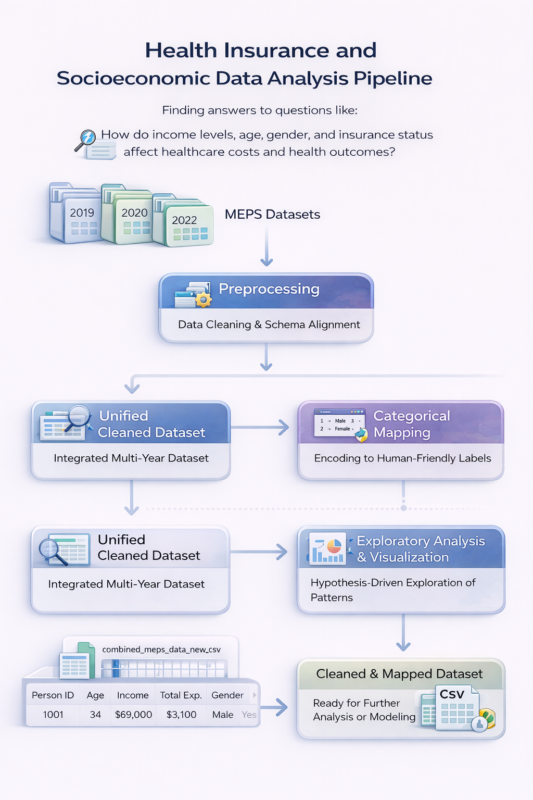

# Health Insurance and Socioeconomic Data Analysis

  

## Overview

This project analyzes large-scale healthcare data to understand how socioeconomic and demographic factors influence healthcare utilization, costs, and outcomes. Using multi-year data from the Medical Expenditure Panel Survey (MEPS), the goal is to uncover meaningful patterns that explain differences in healthcare access and expenditure across populations.

Rather than focusing only on data processing, the project is structured around answering a central question:

**How do income levels, age, gender, and insurance coverage impact healthcare costs and health outcomes?**

The work combines multi-year data integration, structured preprocessing, categorical mapping, and exploratory analysis to build a clean and interpretable dataset for analysis.

## Data

The analysis is based on MEPS datasets spanning multiple years, including 2018 through 2022. These datasets contain detailed individual-level information across several dimensions:

- Demographics (age, gender, race, region)  
- Socioeconomic status (income, employment, education)  
- Healthcare utilization (expenditures, prescriptions, visits)  
- Insurance coverage and access  
- Health indicators (chronic conditions, general health, smoking status)  

A key challenge in this project was that each year’s dataset follows slightly different schemas. As a result, a significant portion of the work focused on aligning and standardizing these datasets into a unified structure.

## Methodology

The pipeline follows a structured sequence of steps, as shown in the diagram above.

The process begins with loading multiple yearly datasets and identifying corresponding variables across different schemas. Since column names vary by year, pattern-based matching and dynamic selection were used to extract consistent features.

The next step involves data cleaning and filtering. Invalid values (such as placeholder codes), missing entries, and inconsistent records were handled to ensure the dataset is reliable. The analysis was restricted to a working-age population to maintain consistency across variables.

After cleaning, the datasets are merged into a single unified dataset. This integrated dataset allows for cross-year comparisons and longitudinal analysis.

A critical step in the pipeline is categorical mapping. Many variables in MEPS are encoded numerically, which makes interpretation difficult. These values were systematically mapped to human-readable categories, improving clarity and enabling meaningful analysis.

Finally, exploratory analysis and visualization were performed to identify patterns, relationships, and trends across demographic and socioeconomic variables.

## Implementation

The data processing pipeline was implemented in Python with a focus on modularity and reproducibility.

Key components include:

- Multi-year dataset loading and alignment  
- Dynamic column selection using pattern matching  
- Data cleaning and filtering  
- Categorical mapping for interpretability  
- Dataset consolidation into a unified structure  

The final output is a cleaned and structured dataset ready for downstream analysis:

## Results and Insights

The analysis reveals several consistent patterns across the dataset.

Socioeconomic variables such as income and employment status show a strong relationship with healthcare expenditures. Individuals in higher income brackets tend to have greater access to healthcare services, while lower-income groups often show reduced utilization despite potential need.

Insurance coverage plays a central role in determining access to care. Individuals with stable insurance coverage demonstrate higher healthcare usage and more consistent expenditure patterns compared to uninsured populations.

Behavioral factors such as smoking status and vaccination history also show meaningful associations with health outcomes and healthcare usage.

Temporal analysis across multiple years highlights changes in healthcare patterns, suggesting potential influences from policy changes, economic conditions, or external events.

Overall, the results reinforce the importance of combining demographic, socioeconomic, and behavioral factors when analyzing healthcare systems.

